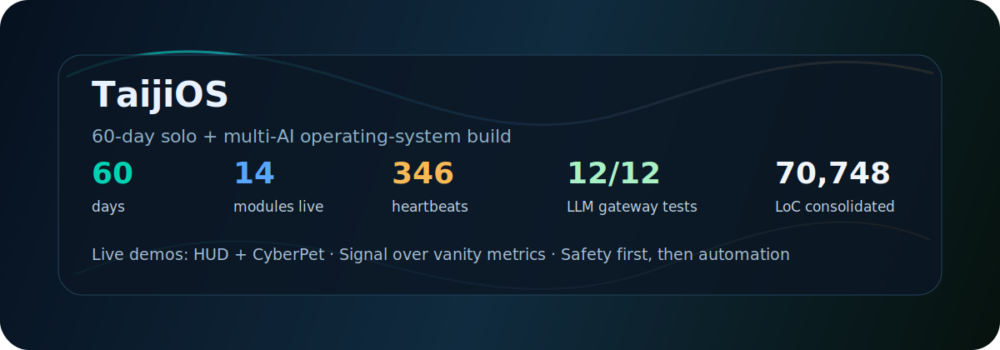

<h1 align="center">TaijiOS · 诸葛亮</h1>

<p align="center">
  Independent developer building <strong>TaijiOS</strong> — a self-learning AI operating system inspired by the <em>I Ching</em>'s 64-hexagram framework.
</p>

<p align="center">
  <a href="https://github.com/yangfei222666-9?tab=followers"></a>
  <a href="https://taijios-hud.netlify.app"></a>
  <a href="https://taijios-cyberpet.netlify.app"></a>
</p>

<p align="center">
  <a href="https://taijios-hud.netlify.app">
    
  </a>
</p>

---

## 👋 关于我 / About

> **前生意合伙人，非 CS 出身**。2026 年大年初一（2026-02-17）在工作区写下第一个 AI agent 的 `SOUL.md`，从此和多个 AI（Claude / Gemini / GPT / DeepSeek 四路并行）一起搭建 TaijiOS。
>
> A non-CS-background former-entrepreneur. Started writing the first AI agent's `SOUL.md` on **Chinese New Year's Day 2026-02-17**, building TaijiOS since then via multi-AI collaboration.

---

## ⚡ 执行密度 / Build Velocity

```
2026-02-17 (Chinese New Year)  →  2026-04-17 (today)
                 60 days
                    ↓
           ✅ 14 modules live (1 🔄 in progress)
           ✅ Ising Heartbeat · 346 heartbeats · 18.8h physics experiment
           ✅ LLM Gateway · 12/12 extreme-scenario tests passed
           ✅ zhuge-skill published to 3 platforms (GitHub + ClawHub + Xiaping)
           ✅ 2 live Netlify demos (HUD + CyberPet)
           ✅ release repo · 48 commits · 70,748 LoC (8-day consolidation)
```

**$0 budget · 0 team · 60 days · 70,748 LoC · 14 modules · 1 phase transition observed.**

This is not a funding story yet. It is an execution-density signal.

---

## 🌀 Core Projects

This profile is the portfolio entrance. Start here, then follow the repo that matches your use case:

| Project | What | Language |
|---|---|---|
| **[taiji](https://github.com/yangfei222666-9/taiji)** | Current main repo — TaijiOS live HUD, five-engine architecture, and Chinese-facing landing | Python |
| **[self-improving-loop](https://github.com/yangfei222666-9/self-improving-loop)** | Standalone reliability layer — trace failures, apply guarded changes, and rollback on regression | Python |
| **[TaijiOS](https://github.com/yangfei222666-9/TaijiOS)** | Legacy prototype — archive candidate; current main development is `taiji` | Python |
| **[TaijiOS-Lite](https://github.com/yangfei222666-9/TaijiOS-Lite)** | Lite prototype / example pack — archive candidate; reusable ideas move into `taiji` | Python |
| **[zhuge-skill](https://github.com/yangfei222666-9/zhuge-skill)** | 诸葛亮 · AI Prediction Advisor — 64-hexagram reasoning for football prediction (demo of TaijiOS decision engine) | Python |

---

## 🧊 Shared Crystal Pool

**[zhuge-crystals](https://github.com/yangfei222666-9/zhuge-crystals)** is the public collaboration surface behind `zhuge-skill`: a sanitized, PR-reviewed decision-crystal pool.

Current verified state:

- Public pool file: `crystals.jsonl`
- Privacy rule: whitelist schema only; no user IDs, team names, timestamps, raw odds, API keys, or free-text notes
- Contribution model: local users sanitize crystals, then submit a PR for maintainer review
- Public entries today: `0` — the infrastructure exists; the next traction target is the first valid sanitized PR

---

## 🛠 Stack

`Python 3.12` · `FastAPI` · `SQLite` · `pyautogui` · `Whisper` · `edge-tts` · `Telegram Bot API` · `Lark / Feishu SDK`

Multi-LLM with auto-failover across 12 providers:
`Claude` · `GPT` · `Gemini` · `DeepSeek` · `Kimi` · `Qwen` · `ZhipuAI` · `Doubao` · `Yi` · `Baichuan` · `MiniMax`

---

## 🔬 Technical Highlights

- **Five-engine architecture** — each engine's responsibility is defined by its *I Ching* trigram, not decoratively but as enforced engineering constraints:
  `震 Zhen` = only recovery · `师 Shi` = only scheduling · `颐 Yi` = only experience learning · `乾 Qian` = situational awareness · `随 Sui` = persona switching.
- **Ising Heartbeat** — maps 6 system dimensions to quantum spins (σ = ±1); 6 spins × 2 states = **64 hexagrams**. In a **346-heartbeat experiment**, the system exhibited a clean phase transition at tick 37 (ΔH = +0.30), then locked 99% of subsequent time in a new stable state. The self-adaptive field converged toward a *kun-virtue* (accommodating) coupling pattern — a physics-level emergence consistent with classical Taoist cosmology.
- **LLM Gateway** — unified auth / rate-limit / multi-provider failover / audit, 12/12 extreme-scenario tests passed.
- **Safe Click (4 gates)** — default-deny RPA click executor: window-binding + region-blacklist + whitelist + OCR-confidence.
- **Self-Improving Loop** — actual code-level feedback-eval-rollback pipeline, not a methodology doc.

---

## 💬 Philosophy

> *任何学说，都只是你的片面镜子。完整的镜子早在你心里 — 我们只是造工具让你看见它。*
>
> *Any school of thought is just a partial mirror of you. The complete mirror is already inside you — we just build the tools to let you see it.*
>
> — from the **ICI protocol**

Not fortune-telling. **Life engineering.**

---

## 🤝 How to Collaborate

**If you're an investor** — I don't have growth curves yet. What I can verify is execution density, technical originality, and cognitive clarity. If you believe "solo + AI collaboration" is a future engineering unit and are open to betting on signal over metrics at Pre-seed, let's talk.

**If you're a potential co-founder** — clone [taiji](https://github.com/yangfei222666-9/taiji), run the live HUD path, and open a GitHub issue if something resonates. No polished CV needed.

**If you're a potential user** — describe your business pain point. We'll evaluate whether a custom skill on top of TaijiOS could be your industry's first landing case.

---

## 📬 Contact

- **GitHub issues preferred** — open an issue on the repo closest to your topic
- Telegram bot: [@TaijiOS_bot](https://t.me/TaijiOS_bot)
- ClawHub: [Zhuge · AI Prediction Advisor](https://clawhub.ai/@yangfei222666-9/zhuge-skill)
- Xiaping: [诸葛亮 · AI 推演军师](https://xiaping.coze.site/)

---

<p align="center">
  <strong>太极生两仪，两仪生四象，四象生万物。</strong><br>
  <em>From Taiji comes Yin and Yang; from Yin and Yang come all things.</em>
</p>

<p align="center">
  <sub>⚡ This README is part of TaijiOS's dogfooding — co-drafted with Claude Opus 4.7 from real commit logs and file timestamps. Every number here is independently verifiable.</sub>
</p>
