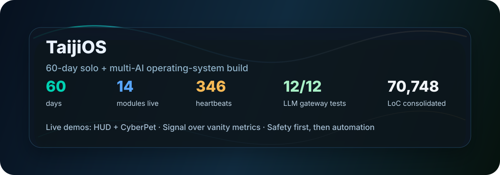

<h1 align="center">小九 — 证据工程师 × 系统操作员 × 中文治理文档作者</h1>

<strong>Evidence Engineer × System Operator × Chinese Governance Docs Author</strong>

  <strong>Not fortune-telling. Life engineering.</strong> 
  从易经状态机出发,现在做的是:让 AI 干活「说得清、验得过、可交接」。

  
  
  
  

  

---

## 当前主线(2026-08)

**AI 工作流的证据门系统**:每步行动留 receipt、关键结论过 gate、拿不准的明写 cannot_claim。

- [taiji](../taiji) —— 主仓库:可运行的 agent 证据链;[评审者 5 分钟验证路径](../taiji/blob/main/docs/START_HERE_FOR_REVIEWERS.md) + [交互式架构图](../taiji/tree/main/docs/architecture)
- [taijios-product-spine-roadmap](../taijios-product-spine-roadmap) —— 可导航、可审计的中文治理文档(CONTROL_BOARD)
- [dsh-skill-multi-model-review](../dsh-skill-multi-model-review) —— DSH 社区技能:四视角候选评审(零依赖)
- [DSH 官方社区帖 #2278](https://github.com/deepseek-ai/deepseek-harness/discussions/2278) —— web 配置 B 类插件兼容实测

## Building Reliable Agent Infrastructure

以下入口用于公开复核;版本、运行状态与结论以各仓库的当前证据为准:

- [self-improving-loop v0.1.1](../self-improving-loop/releases/tag/v0.1.1) —— 可靠性与回滚层的发布入口
- [zhuge-skill](../zhuge-skill) —— 垂直案例入口
- [zhuge-crystals](../zhuge-crystals) —— 脱敏、评审后的协作入口

## 我不宣称的(边界)

- 不宣称 AGI;一切结论按证据分级(verified / partial / unverified / cannot_claim)
- 六爻/易经用于状态机隐喻与决策结构,不作预测真值

## Live demos(仍在运行)

- [TaijiOS HUD](https://taijios-hud.netlify.app) · [CyberPet](https://taijios-cyberpet.netlify.app)

## 协作入口

- **No polished CV needed** —— 请直接给出可复现问题、目标或贡献提案。
- **GitHub issues preferred** —— 在最接近主题的仓库提交 issue。
